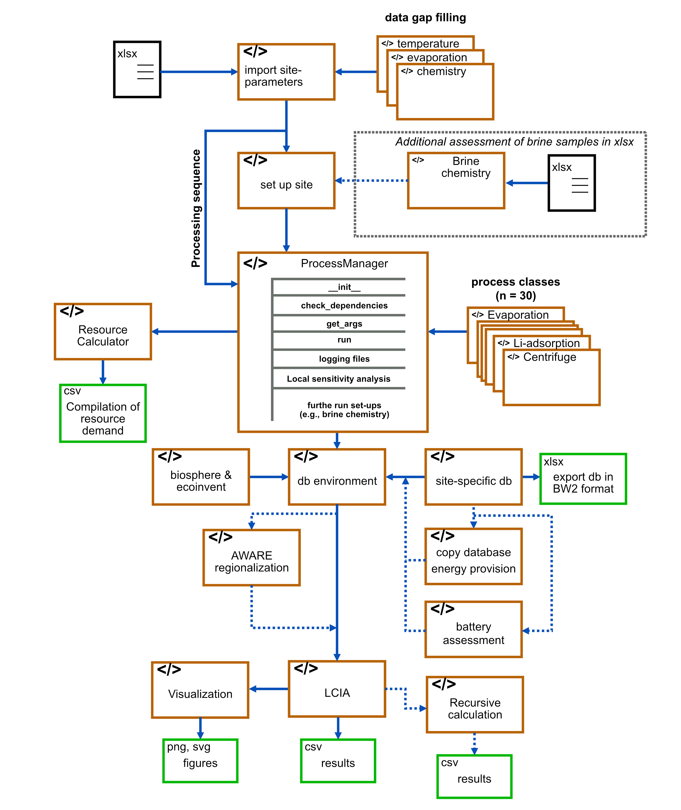

# Global model to estimate life cycle impacts of lithium mining from brines

## Overview

This repository contains a model to quantify life cycle impacts of lithium carbonate production from brines. The model uses site-specifc data to model the lithium carbonate production 
(see \data\input_data_lithiumsites.xlsx). The model contains 30 processes based on existing literature (patents, technical reports, scientific papers, governmental reports, etc.). 
The model uses the calculated mass flow and estimate technosphere and biosphere flows for each process. 
The model calculates the life cycle inventory and then, uses Brightway 2 to perform the life cycle assessment (see more information https://github.com/brightway-lca). 

The model is based on the following publication: Schenker and Pfister (2025) - Current and Future Impacts of Lithium Carbonate from Brines: A Global Regionalized Life Cycle Assessment Model 

https://doi.org/10.1021/acs.est.4c12619

## How the model creates LCI and performs LCA

1. Import of relevant input data from excel file stored in \data (e.g., location, brine chemistry, etc.) -> import_site_parameters.py
2. Modeling of lithium extraction from brines based on processing_sequence -> \src\LifeCycleInventoryModel_Li\licarbonate_processes.py
3. Import of biosphere and ecoinvent -> \src\BW2_calculations\lci_setting_up_bio_and_ei.py
4. Creating site-specific database -> \src\BW2_calculations\lci_lithium_site_db.py
5. Modification of specific activities for further regionalization -> \src\BW2_calculations\lci_create_sitespecific_inven_BW2.py
6. Import impact categories (AWARE) and link with existing databases -> \src\BW2_calculations\lcia_method_waterscarcity.py
7. Calculation of life cycle impacts -> \src\BW2_calculations\lcia_impact_assessment.py
8. Visualization of results -> \src\Postprocessing_results\visualization.py

## How to use the model

Assessment of all sites in this publication can be performed using the comparison_all_sites.py
